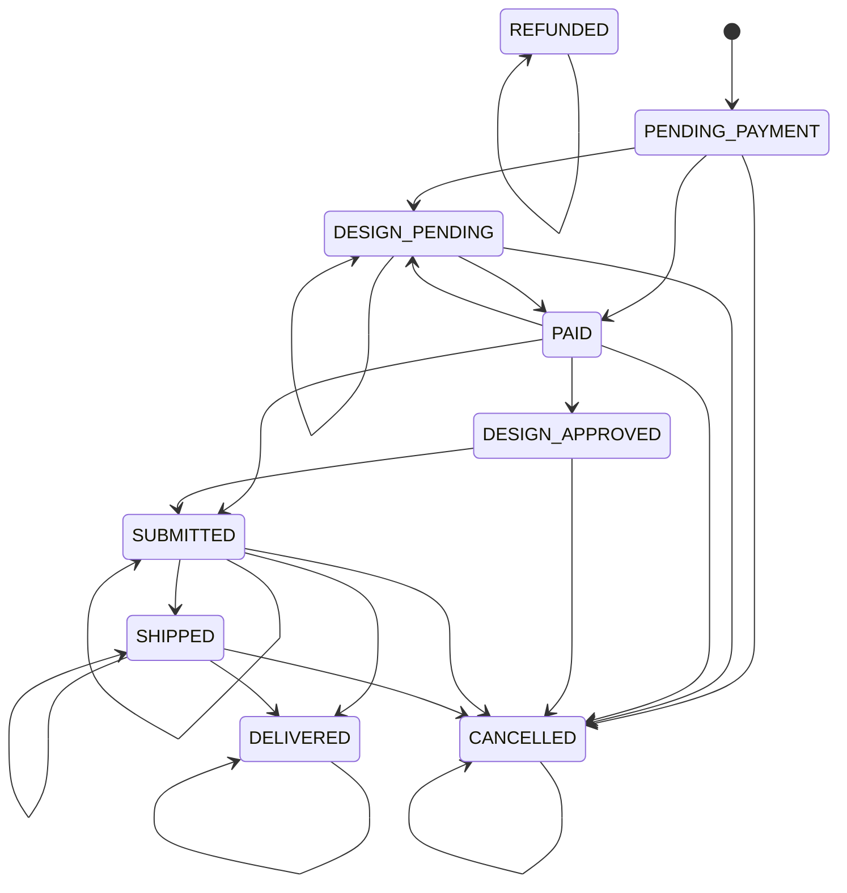

# Order Status State Machine (generated)

Generated: 2025-12-12T22:10:20.461Z

## Allowed Actions

| Action | Allowed statuses |
| --- | --- |
| `design_approve` | `PAID`, `DESIGN_APPROVED` |
| `design_clone_to_preview` | `PENDING_PAYMENT`, `DESIGN_PENDING` |
| `design_generate_authed` | `PAID`, `DESIGN_PENDING`, `PENDING_PAYMENT` |
| `design_generate_guest` | `PENDING_PAYMENT`, `DESIGN_PENDING` |
| `order_checkout` | `PENDING_PAYMENT`, `DESIGN_PENDING` |
| `order_claim_preview` | `PENDING_PAYMENT`, `DESIGN_PENDING` |
| `order_preview_variant_update` | `PENDING_PAYMENT`, `DESIGN_PENDING` |
| `order_submit_fulfillment` | `PAID`, `DESIGN_APPROVED` |
